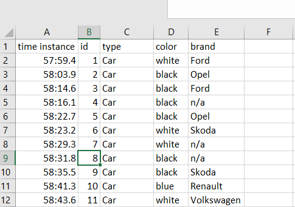
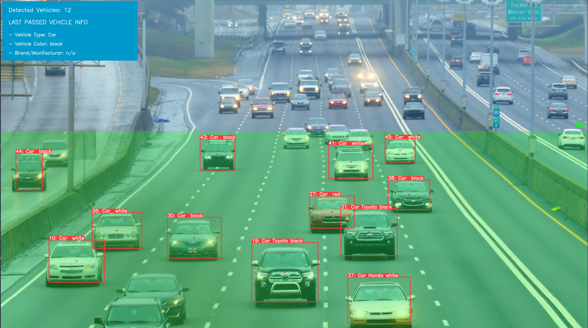
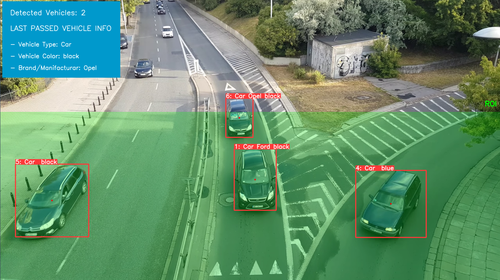
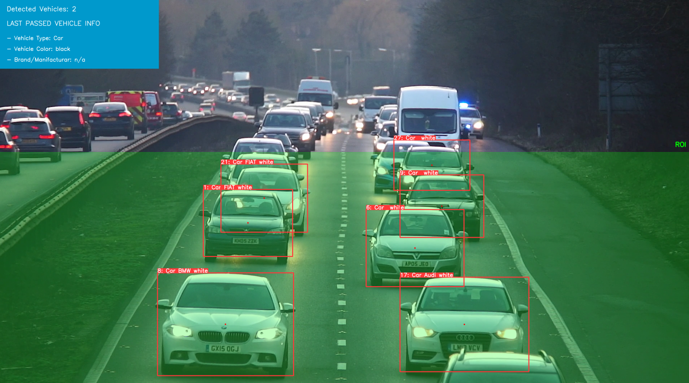

<div>
<h1>Real-Time Road Traffic Monitoring System using YOLOv5</h1>
<br>

<p>
</a>
</p>
<p>

This repository focuses on "real-time monitoring of road traffic" using machine learning and computer vision techniques. Yolov5 has been used for the detection perposes in collaboration with some other deep learning models.
</p>
</div>

## <div>General Capabilities</div>

This repository implements most of the features which are required for complete road traffic monitoring system, here are the additional capabilities of it:

* <b>Detection and classification of the vehicles:</b> YOLOv5 small model was trained on 5 different classes (car, truck, bicycle, motorcycle, bus).

* <b>Vehicle Color Recognition:</b> A custom Keras model was trained on 7 different classes (white, black, red, blue, orange, green, yellow). A custom vehicle dataset was prepared based on color classes with image size of 32x32 pixels. The training code has been given in vehicles_color_keras.ipynb notebook.

* <b>Vehicle Brand Recognition:</b> Another YOLOv5 small model was trained on vehicle's logos in cropped vehicle images. This repo covers 13 different classes for car brands (Audi, Mercedes, BMW, Honda, Toyota, Hyundai, Opel, Peugeot, Renault, Skoda, Volkswagen, FIAT, Ford).

* <b>Vehicle Counting:</b> Vehicle Counting was achieved by implementing DeepSort Object Tracking which assigns a unique id to every detection bounding box in sequencial frames.

* <b>Exporting Results:</b> The information against every vehicle is exported in a CSV for every run.

<br>
<div align="center">
</a>
</div>
<br>

## <div>Quick Start Examples</div>

<details open>
<summary><h3><b>Install</b></h3></summary>

[**Python>=3.7.0**](https://www.python.org/) is required with all
requirements.txt installed including
[**PyTorch>=1.7**](https://pytorch.org/get-started/locally/):

```bash
$ git clone https://github.com/NaumanHSA/Real-Time-Traffic-Monitoring-System-using-YOLOv5.git
$ cd yolov5
$ pip install -r requirements.txt
```

</details>

<details open>
<summary><h3><b>Inference</b></h3></summary>

Inference can be performed directly by running the inference.py script. But before we have to make sure the configurations are set in the CONFIG.py file, e.g. SOURCE is the path to any video or images directory or an image.

```bash
    python inference.py
```

</details>

<details open>
<summary><h3><b>Configuration File</b></h3></summary>
The project configuration has been all defined in the CONFIG.py script. Some of the configurations need to be set according to the source video or images but most of them remains constant. Following is the breif explaination for every parameter:

<br>
<h3>General Configurations</h3>

* <b>SOURCE: </b>Path to input image, video or directory containing images/videos for inference
* <b>DETECT_BRAND: </b>brand recognition True/False
* <b>DETECT_COLOR: </b>color recognition True/False
* <b>VIS: </b>Visualize detections during inference if True
* <b>SAVE_CROPS: </b>Save cropped prediction boxes if True
* <b>OUTPUT_PATH: </b>Save path for crops and results.csv
* <b>AREA_THRESHOLD: </b>This is very important parameter which need to be adjusted according to video/image. Area threshold specifies Region of Interest (ROI) and is an array of two elements which is start and end in percentage respectively. It basically represents the y values of a frame within which the detections will be considered. For example, [0.4, 1.0] will mark area from 40% to 100% of the image height from top to bottom as shown below:

<br>
<p float="left">
  
  
</p>
<p float="left">
  
</p>
<br>

<br>
<h3>YOLO Configurations</h3>
    There are two YOLOv5 models working in this project and every model has some specific parameters. Hence, two different classes have been created named Vehicle and Logo. Every class have params to set explained below:

<br>

* <b>self.weights: </b>Path to weights file e.g. /weights/yolov5s_best.pt
* <b>imgsz: </b>model input image size on which it was trained
* <b>conf_thres: </b>confidence threshold used while NMS
* <b>iou_thres: </b>IoU threshold used while NMS
* <b>line_thickness: </b>used to scale the bounding boxes drawn on the frame

</details>

## <div>Author</div>

Muhammad Nouman Ahsan

## <div>References</div>

* YOLOv5 https://github.com/ultralytics/yolov5
* Deep SORT https://github.com/nwojke/deep_sort
* VEHICLE DETECTION, TRACKING AND COUNTING https://github.com/ahmetozlu/vehicle_counting_tensorflow
* A Large-Scale Car Dataset for Fine-Grained Categorization and Verification 
    Paper: https://arxiv.org/abs/1506.08959

    Website: http://mmlab.ie.cuhk.edu.hk/datasets/comp_cars/index.html
